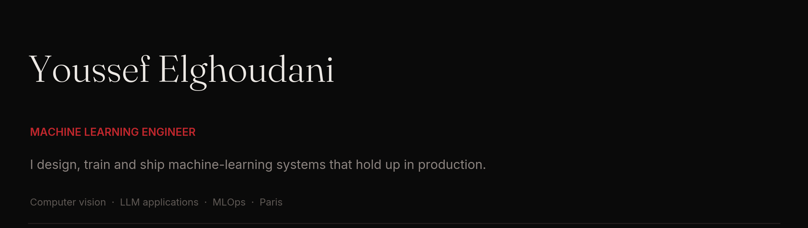
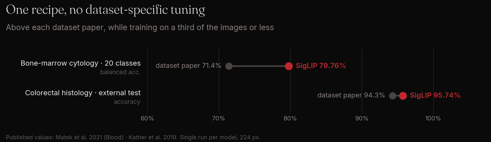

I'm a machine learning engineer with a background in both computer science and statistics, and I work mostly in deep learning. The statistics side stops me from shipping a number I can't defend. The engineering side gets the model in front of someone who needs it.

Most of my work has been in **medical imaging**, where a classifier helps a specialist decide but doesn't decide for them, and with **organisations whose own data was too fragmented to answer their questions**. Both taught me the same thing: the model is rarely the hard part.

**[elghoudani.com](https://elghoudani.com)** · **[elghoudaniyoussef0@gmail.com](mailto:elghoudaniyoussef0@gmail.com)** · Paris · open to ML engineering roles (CDI)

---

### Medical imaging: one framework, four datasets

I built a classification pipeline around the leukocyte work below and ran it on four public medical datasets. Each one used the same fixed recipe with no tuning for the dataset. The splits were grouped by patient, and every result is reported on the official test sets.

| Dataset | Result | Code | Demo |
|---|---|---|---|
| **Bone-marrow cytology** · 20 cell types | 79.76% balanced accuracy, **+8.4 pts** over the dataset paper | [repo](https://github.com/Elghoudani/bone-marrow-cells-classification) | [live](https://bone-marrow-cells.streamlit.app) |
| **Colorectal histology** · NCT-CRC-HE | 95.74% on the external set of new patients | [repo](https://github.com/Elghoudani/nct-crc-tissue-classification) | [live](https://nct-crc-tissue.streamlit.app) |
| **Retinal OCT** · Kermany OCT2017 | 96.49% after removing the **33%** of training scans that came from test patients | [repo](https://github.com/Elghoudani/oct-retina-classification) | [live](https://oct-retina.streamlit.app) |
| **Breast ultrasound** · BUSI | 87.18%, plus why this dataset's leaderboard can't be trusted | [repo](https://github.com/Elghoudani/busi-breast-ultrasound-classification) | [live](https://busi-breast-ultrasound.streamlit.app) |

### Selected work

| | |
|---|---|
| **[Automated leukocyte classification](https://elghoudani.com/work/automated-leukocyte-classification)** | An in-house white-blood-cell classifier for a medical-biology group with 40+ labs. **95.8% macro F1** across 12 classes on 39k clinician-validated images. It is built as decision support for the biologists, not a replacement. |
| **[The Link](https://elghoudani.com/work/the-link)** | Joined data that each department of a large residential landlord kept separately into one documented base that covers the whole estate. |
| **[Kickvision](https://github.com/Elghoudani/kickvision)** | Tactical, physical and biomechanical analytics for football, NFL and basketball from a single sideline camera, combined with the athlete's physiological data. Runs on CPU only. |
| **[Paper to EPUB](https://github.com/Elghoudani/paper-to-epub)** | Converts multi-column academic papers full of equations and figures into EPUBs that read well on e-ink. Runs fully offline. |
| **Freight AI assistant** | A conversational assistant for a startup that moves cargo between Europe and the Gulf. *In progress.* |

### Competitions

| | |
|---|---|
| **DrivenData: DaT Parkinson's Challenge** | **6th of 1,009**, final private leaderboard · AUROC 0.949 · [write-up](https://elghoudani.com/work/dat-parkinsons-challenge) |
| **Kaggle: CSIRO Image2Biomass** | **6th place** |
| **Kaggle: AI Mathematical Olympiad, Progress Prize 2** | **Top 10** |

### Stack

**Deep learning:** PyTorch · Hugging Face Transformers · DDP / FSDP / DeepSpeed · mixed precision  
**Vision:** YOLO · Detectron2 · ViT / Swin · CLIP / SigLIP · DINOv2 · ONNX / TensorRT  
**LLMs:** agents & tool use · LoRA / QLoRA · DPO · quantization (GGUF, AWQ) · vLLM · LLM-as-judge evals  
**MLOps:** Python · SQL · FastAPI · Docker · Kubernetes · MLflow · Weights & Biases · CI/CD · drift monitoring

Verifiable Coursera certificates, including IBM Data Engineering, IBM Machine Learning, Microsoft DP-100 and AWS Solutions Architect. [See all of them →](https://elghoudani.com/#certifications)
